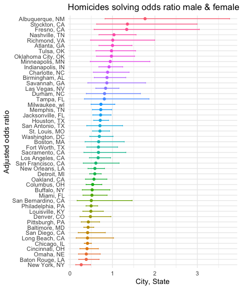

p8105_hs3393_hw6
================
Haochen Sun
2022-11-29

``` r
library(tidyverse)
library(ggplot2)
library(modelr)
library(leaps)

knitr::opts_chunk$set(
  fig.width = 5,
  out.width = "60%"
)

theme_set(theme_minimal() + theme(legend.position = "bottom"))

options(
  ggplot2.continuous.colour = "viridis",
  ggplot2.continuous.fill = "viridis"
)
```

## Problem 1

``` r
weather_df = 
  rnoaa::meteo_pull_monitors(
    c("USW00094728"),
    var = c("PRCP", "TMIN", "TMAX"), 
    date_min = "2017-01-01",
    date_max = "2017-12-31") %>%
  mutate(
    name = recode(id, USW00094728 = "CentralPark_NY"),
    tmin = tmin / 10,
    tmax = tmax / 10) %>%
  select(name, id, everything())
```

    ## Registered S3 method overwritten by 'hoardr':
    ##   method           from
    ##   print.cache_info httr

    ## using cached file: ~/Library/Caches/R/noaa_ghcnd/USW00094728.dly

    ## date created (size, mb): 2022-11-29 19:37:04 (8.426)

    ## file min/max dates: 1869-01-01 / 2022-11-30

``` r
# linear regression argument by bootstrap

boot_result <- weather_df %>% 
  bootstrap(n = 5000) %>% 
  mutate(
    model = map(strap, ~lm(tmax ~ tmin, data = .x)),
    result = map(model, broom::tidy),
    result2 = map(model, broom::glance)
  )

conf_result <- boot_result %>% 
  unnest(result) %>% 
  select(term, estimate, result2) %>% 
  unnest(result2) %>%  # two steps of unnest because some variable names overlap
  select(term, estimate, r.squared) %>% 
  pivot_wider(names_from = term, values_from = estimate) %>% 
  rename(b0 = `(Intercept)`,
         b1 = tmin) %>% 
  mutate(log_b0b1 = log(b0*b1)) %>% 
  summarise(
    rsquare_ci_lower = quantile(r.squared, 0.025),
    rsquare_ci_upper = quantile(r.squared, 0.975),
    log_b0b1_ci_lower = 
      quantile(log_b0b1, 0.025),
    log_b0b1_ci_upper = 
      quantile(log_b0b1, 0.975)
  ) %>% 
  mutate(across(where(is.numeric), round, 4)) # save 4 digits
```

Therefore, we can see that the 95% confidence interval for $\hat{r^2}$
is (0.8936, 0.9273 ), the 95% confidence interval for
$log(\hat{\beta_0}*\hat{\beta_1})$ is (1.9634, 2.06).

## problem 2

``` r
data <- read_csv("data/homicide-data.csv") %>% 
  janitor::clean_names() %>%
  unite("city_state", c(city, state), sep = ", ", remove = F) %>%
  filter(!city_state %in% c("Dallas, TX", "Phoenix, AZ", "Kansas City, MO", "Tulsa, AL")) %>% 
  mutate(solve = if_else(
    disposition != "Closed by arrest",
    true = 0, false = 1
  )) %>% # 0 means the case is unsolved 
    filter(victim_race %in% c("Black", "White")) %>% 
  mutate(victim_age =  as.numeric(victim_age))
```

    ## Warning in mask$eval_all_mutate(quo): NAs introduced by coercion

``` r
balt_model <- baltimore <- data %>% 
  filter(city_state == "Baltimore, MD") %>% 
  glm(solve ~ victim_age + victim_sex + victim_race, data = .,family = binomial())

balt_result <- balt_model %>%
  broom::tidy() %>% 
  mutate(OR = exp(estimate)) %>% 
  mutate(lower = exp(confint(balt_model)[,1]),
         upper = exp(confint(balt_model)[,2])
  ) %>% 
  select(term, OR, lower, upper) %>%
  filter(term == "victim_sexMale") %>% mutate(across(where(is.numeric), round, 4))
```

The estimated odds ratio for solving homicides comparing male victims to
victims is 0.4255, the 95% confidence interval for it is (0.3242,
0.5576).

``` r
# Glm for all cities

all_model <- data %>% 
  nest(data = -city_state) %>% 
  mutate(model = map(data, ~glm(solve ~ victim_age + victim_sex + victim_race, data = .x,family = binomial()))
         ) %>%
  mutate(
    results = map(model, broom::tidy)
  )

all_result <- all_model %>% 
  select(city_state, model, results) %>% mutate(
    lower = map(.x = model, ~exp(confint(object = .x)[,1])),
    upper = map(.x = model, ~exp(confint(object = .x)[,2])) 
    )%>% 
  select(-model) %>% 
  unnest(results, lower, upper) %>% 
  mutate(OR = exp(estimate)) %>% 
  select(city_state, term, OR, lower, upper) %>% 
  filter(term == "victim_sexMale")

all_result %>% 
  mutate(city_state = fct_reorder(city_state, OR)) %>% 
  ggplot(aes(x = city_state, y = OR, color = city_state)) +
  geom_point() +
  geom_errorbar(aes(ymin = lower, ymax = upper), width = 0.2) + 
  coord_flip() +
  theme(legend.position="none")+
  labs(x = "Adjusted odds ratio", 
       y = "City, State",
       title = "Homicides solving odds ratio male & female" )
```



Homicides in which the victim is male are significantly less like to be
resolved than those in which the victim is female in many cities, eg.
New York, Chicago and Baltimore. In no city homicides in which victim is
female are significantly less likely to be resolved as no lower bound of
the odds ratio is less than 1.

## Problem 3

``` r
data <- read_csv("data/birthweight.csv") %>% 
  mutate_at(c("babysex", "frace", "malform", "mrace"), as.factor)
```

    ## Rows: 4342 Columns: 20
    ## ── Column specification ────────────────────────────────────────────────────────
    ## Delimiter: ","
    ## dbl (20): babysex, bhead, blength, bwt, delwt, fincome, frace, gaweeks, malf...
    ## 
    ## ℹ Use `spec()` to retrieve the full column specification for this data.
    ## ℹ Specify the column types or set `show_col_types = FALSE` to quiet this message.

``` r
which(is.na(data) == T)
```

    ## integer(0)

The dataset have no NA.

### Model building

We will start model building by stepwise variable selection by adjusted
R squared.

``` r
mat <- as.matrix(data)

models <- regsubsets(bwt ~ ., data = data, nvmax = 19)
```

    ## Warning in leaps.setup(x, y, wt = wt, nbest = nbest, nvmax = nvmax, force.in =
    ## force.in, : 3 linear dependencies found

    ## Reordering variables and trying again:

``` r
model_summary <- summary(models)

plot(model_summary$adjr2, xlab="No of parameters", ylab="Adj R2")
```


``` r
diff(model_summary$adjr2)
```

    ##  [1]  1.231364e-01  1.152923e-02  9.434166e-03  4.630898e-03  3.740283e-03
    ##  [6]  3.503588e-03  1.749650e-03  6.823132e-04  3.050683e-04  1.951377e-04
    ## [11]  1.745699e-04  1.180981e-04  2.894726e-05  1.629030e-05 -3.985467e-05
    ## [16] -6.046029e-05 -5.936728e-05 -6.154730e-05 -6.422738e-05

``` r
coef(models, id = 4)
```

    ##  (Intercept)        bhead      blength        delwt       mrace2 
    ## -5752.498981   136.625713    80.089173     2.327163  -122.643181

My modeling procedures are: first use `regsubsets` function in `leap`
package, plot adjusted R squared against variable numbers. Then, find
the optimal variable numbers, use `coef` function to select the best 4
variables to fit in the linear model.

Use adjusted R squared as the criteria, we can see that after the
variable number greater than 4, the contribution of adding a new
variable will help adjusted R squared increase less than 0.005
(subjectively selected), which means adding them will have trivial
contribution to the model, so we use 4 as the cutoff point. During that
process as mrace2 is indicated as a important variable, it would be no
harm to put mrace all in the model.

``` r
select_model <- lm(bwt ~ bhead + blength + delwt + mrace, data = data)

data %>%
  add_predictions(select_model) %>% 
  add_residuals(select_model) %>% 
  ggplot(aes(x = pred, y = resid))+
  geom_point()+
  labs(
    x = "Predicted weight (g)",
    y = "Residuals",
    title = "Residual vs Predicted Value"
  )
```


``` r
cv_df <- 
  crossv_mc(data, 100) %>%
  mutate(
    select_mod = map(
      train, ~lm(bwt ~ bhead + blength + delwt + mrace, data = .x)
    ),
    main_2_mod = map(
      train, ~lm(bwt ~ blength + gaweeks, data = .x)
    ),
    inter_3_mod = map(
      train, ~lm(bwt ~ bhead + blength + babysex + bhead:blength + bhead:babysex + blength:babysex + bhead:blength:babysex, data = .x))
  ) %>% 
  mutate(
    rmse_select = map2_dbl(select_mod, test, ~rmse(model = .x, data = .y)),
    rmse_main2 = map2_dbl(main_2_mod, test, ~rmse(model = .x, data = .y)),
    rmse_inter3 = map2_dbl(inter_3_mod, test, ~rmse(model = .x, data = .y))
  )

cv_df %>% 
  select(starts_with("rmse")) %>% 
  pivot_longer(
    everything(),
    names_to = "model",
    values_to = "rmse",
    names_prefix = "rmse_") %>% 
  mutate(model = fct_inorder(model)) %>% 
  ggplot(aes(x = model, y = rmse)) + 
  geom_violin(aes(color = model)) +
  labs(x = "Models",
       y = "RMSE"
         )
```


The selected model (including 4 variables) have a generally lower RMSE,
having better performance in predicting, while the model have 2 main
effects (length at birth and gestational age) have higher RMSE and
preform worst in prediction among the three models.
